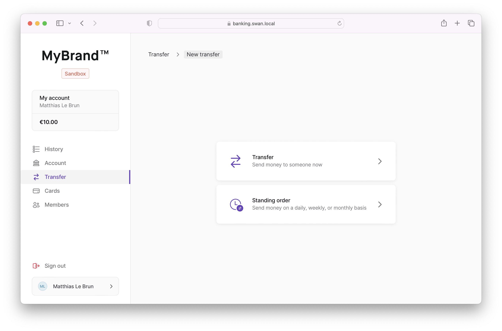
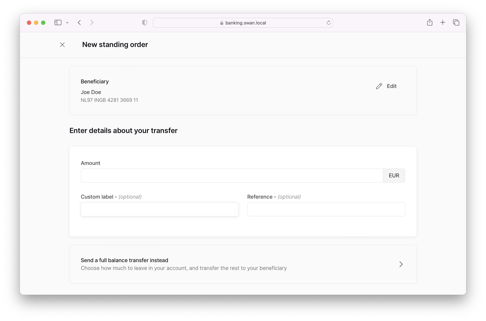

# Transfer

Along with the main navigation, the **transfer page** should include the following content:

- **New transfer** call to action, through which you can send a new transfer or schedule a new standing order
- List of **active standing orders** with option to filter for canceled standing orders
  - Recipient
  - Short explanation
  - Recurrence
  - Next execution
  - Amount
  - Actions (notably, a **cancel** button)

## Transfer types

You can pick between **regular** and **standing order** (recurring transfer).

## New transfer

When sending a new transfer, the following information should be collected from the user:

- Recipient name
- Recipient IBAN
- Reason (short explanation, reference number—whatever is needed for your use case)
- Transfer amount
- Schedule (_standard_ by default; can also choose _instant_)

After the user clicks **Confirm** to send their transfer, redirect them to your consent URL.

:::info Instant transfers with fallback
For instant transfers, consider using `InstantWithFallback` mode.
If instant transfers aren't available for any reason, the transfer will continue as a standard transfer.
This saves the user from needing to send a different transaction.
Learn more about [transfer modes](https://docs.swan.io/concept/payment/instant-credit-transfer#fallback-to-standard-transfer) in our main documentation.
:::

## New standing order

When sending a new standing order, the following information should be collected from the user:

- Recipient name
- Recipient IBAN
- Reason (short explanation, reference number—whatever is needed for your use case)
- Transfer type (_specified amount_ or _full balance_) and amount
  - For _full balance transfers_, the user indicates how much should be left in the account. Everything else is transferred.
- Schedule (_daily_, _weekly_, or _monthly_)

After the user clicks **Confirm** to send their transfer, redirect them to your consent URL.

